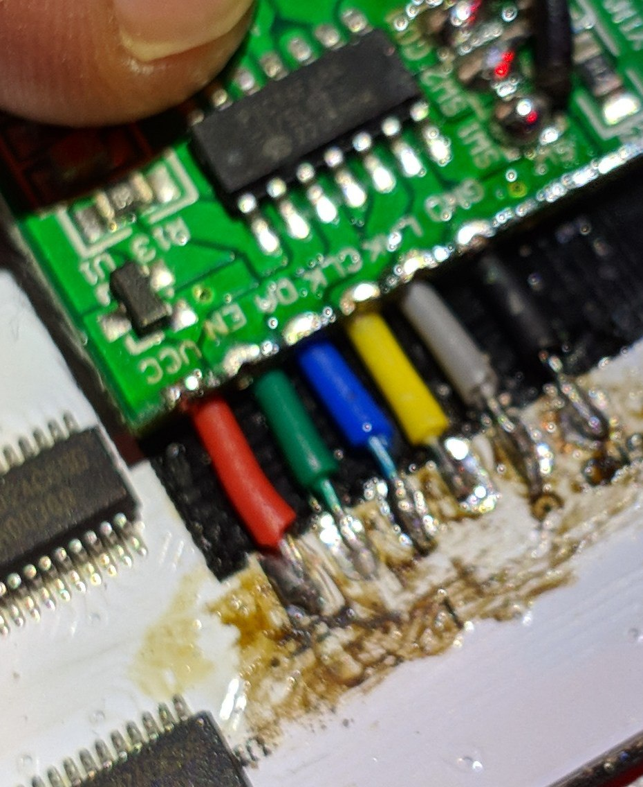

## Blinkenbox

Look into `pix/` for the latest state of the art.

```
$ cd pix/
$ make run
```

## Pinout

```
GP0: LATCH (gray)
GP1: CLK (yellow)
GP2: DATA (blue)
GP3: ENABLE (green)
GP13: Button COM (red)
GP14: Button 1 (white)
GP15: Button 2 (Black)
```





## Interference
Separate the red VSYS cable from the signal wires!! Otherwise you'll likely get strange artefacts when the USB is connected


